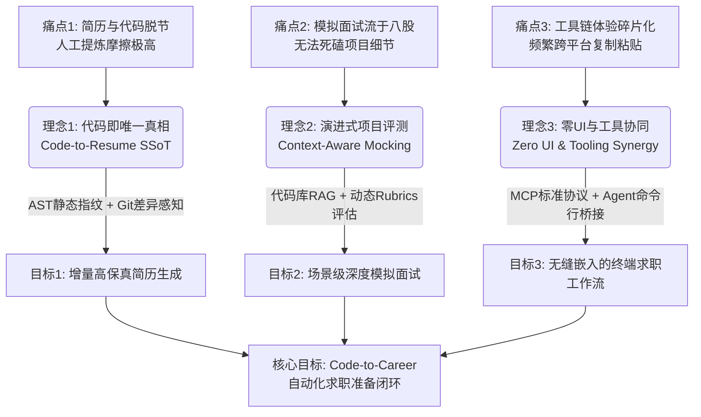
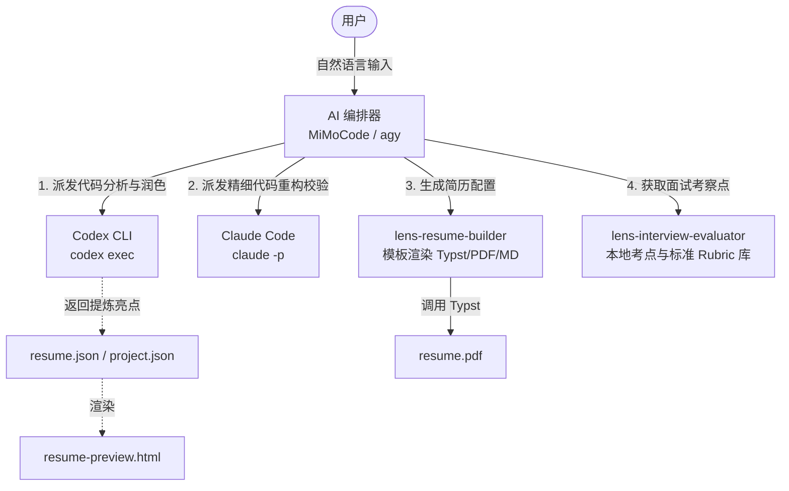
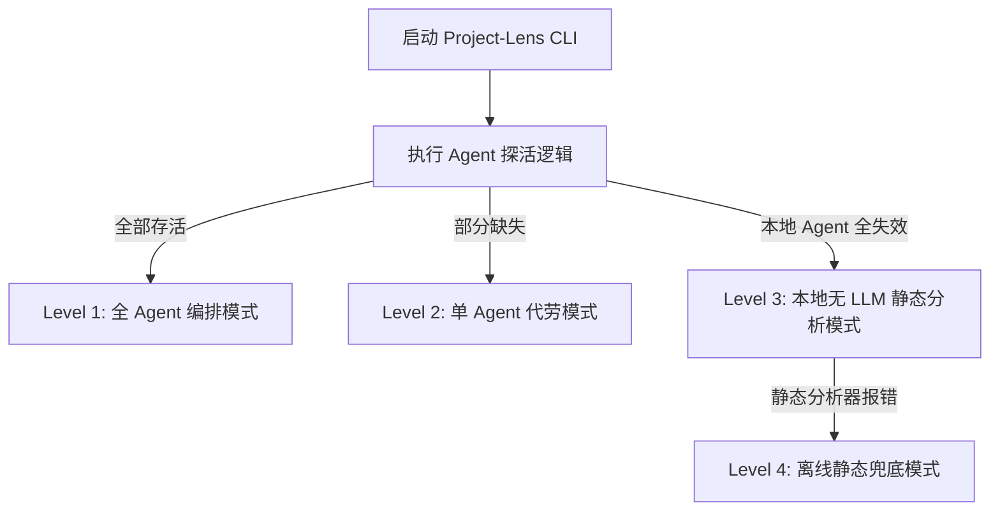

# Project-Lens V2 计划书：AI-First 本地 CLI 与 MCP 工具链设计

> **版本**: 2.0 (优化版) | **协调者**: MiMoCode | **评估方**: agy (Gemini Antigravity) + codex (LongCat-2.0)

在 V1 计划中，我们设计了一个基于 Next.js 和 FastAPI 的传统 Web 应用。而在 V2 中，我们打破常规，将项目重构为 **"AI-First / CLI-First 的本地工具链"**。

我们不仅不再开发复杂的 Web 界面，更在架构设计上引入了 **"本地多 Agent 协同 (Local Multi-Agent Orchestration)"** 的前沿理念。

我们将 Project-Lens 改造为一组本地的 **Skills / MCP Tools**，直接注册给本地的 AI 编程助手（如 [claudecode](https://github.com/anthropics/claude-code)、[agy](file:///C:/Users/31239/.gemini/antigravity-cli/builtin/skills/antigravity_guide/SKILL.md)、[mimocode](https://github.com/mimocode) 等）。同时，Project-Lens 的本地控制端能够通过命令行直接调用和联动本地的其他 AI 助手，形成 **"AI 助手驱动 AI 助手"** 的协同网络。

---

## 一、 核心理念与痛点模型

### 1. 我们要解决什么问题？（痛点分析）

* **痛点一：简历定制的"高摩擦与脱离实际"**
  程序员的"项目池"都沉淀在本地的代码仓库里。但每次投递不同岗位时，我们都需要手动修改 Word/Markdown，费时费力地从代码中提炼"技术亮点"和"业务贡献"。这导致简历定制摩擦极高，或者提炼出的文字流于表面，无法真实体现代码的设计精妙。
* **痛点二：模拟面试的"脱离项目与花拳绣腿"**
  市面上绝大多数 AI 模拟面试（如网页版 GPT 对话）都是"通用八股文"式的。它们不理解你项目的真实代码细节，只能问一些泛泛的理论题。而真实的硬核技术面试，面试官一定会**死磕你简历项目的代码细节、架构瓶颈与边界演进**（"如果并发量大 10倍，你目前的缓存代码怎么重构？"）。
* **痛点三：工具的"界面割裂与操作冗余"**
  传统的求职准备平台要求用户在网页端不断地复制粘贴简历、配置 API Key、在各种表单间切换。对于开发者来说，我们每天 90% 的时间都在 IDE 和终端里。求职准备不应该是一个独立的网页，而应该是开发流的延伸。

### 2. 设计理念与技术实现路径

为了消除上述痛点，Project-Lens V2 坚守以下三大设计理念，并提供明确的技术实现路径：



* **【理念一】代码是简历的唯一真相（Code as the Source of Truth）**
  * **技术实现路径**：开发 `lens-analyzer` 引擎。通过静态 AST（抽象语法树）分析工具扫描本地代码结构（如捕获核心库的引用、特定设计模式的类继承），结合 Git 提交历史（提取包含 "Refactor"、"Optimize"、"Fix" 的 Commit 日志及对应的 Diff），对项目进行客观的画像指纹提取，作为 AI 简历亮点的原始事实输入。
* **【理念二】基于代码上下文的演进式评测（Context-Aware Mocking）**
  * **技术实现路径**：构建以代码仓（Codebase）为检索范围的本地轻量 RAG 系统。在 `lens-interview-evaluator` 中，将项目的核心代码片段、重构前后的 Diff 和本地的技术栈考点库关联，在面试时为大模型输入精准的"项目上下文描述"和预设的标准评分细则（Rubric），使 AI 能够针对具体代码行进行追问。
* **【理念三】无界接入与极简操作（Zero UI & Tooling Synergy）**
  * **技术实现路径**：
    * **向下封装能力**：Project-Lens 底层核心全部使用 CLI 工具输出，不包含任何 GUI，仅输出结构化 JSON 和 Typst 编译的 PDF。
    * **向上标准输出**：实现 Model Context Protocol (MCP) 接口，直接将本地分析和面试评测能力注册为标准 MCP Tools，无缝挂载给 `claude-code` 或 `agy` 等大模型终端，将求职准备直接嵌入开发者的日常终端流。

### 3. 核心目标

构建 **"代码即求职 (Code-to-Career)"** 的闭环自动化终端流：

**写完代码** → **一键提炼真实亮点** → **自动编译高保真 PDF 简历** → **基于本项目真实代码开展死磕式模拟面试**

---

## 二、 产品定位与成本模型

> **修订说明**：原计划声称"零 LLM API 成本"和"Local Only"，但实际依赖 `claude -p`（需 Anthropic API Key）和 `codex exec`（代码上传云端推理），存在逻辑矛盾。本节进行了修正。

Project-Lens V2 是一个 **"本地优先 (Local-First)"、"增强可选 (LLM-Optional)"** 的 CLI/MCP 工具链。

```
┌─────────────────────────────────────────────────────────┐
│                    Project-Lens V2                       │
├─────────────────────────────────────────────────────────┤
│ 核心层 (Core)  │ 零API成本 · 纯本地 · 无隐私风险        │
│  - AST 解析    │ 基于 tree-sitter，无需 LLM              │
│  - Git 历史挖掘│ 纯本地 git log 分析                     │
│  - Schema 校验 │ Zod 强类型校验                          │
│  - Typst 渲染  │ 纯本地编译，无需网络                    │
├─────────────────────────────────────────────────────────┤
│ 增强层 (Enhance)│ 可选LLM · 用户可控 · 成本透明          │
│  - claude -p   │ 需要用户自有 API Key，成本按 token 披露  │
│  - codex exec  │ 需要用户自带模型，代码上传需明确告知     │
│  - ollama      │ 本地模型选项，零API成本但需GPU          │
└─────────────────────────────────────────────────────────┘
```

**成本与隐私承诺**：
- **核心能力零成本**：AST 解析、Git 分析、Schema 校验、PDF 渲染均纯本地执行，不依赖任何云端 API。
- **增强能力透明使用**：如需更高质量的亮点提炼/面试评估，用户可自行接入云端 API 或本地模型。
- **隐私边界明确**：核心层代码永不上传；增强层上传前需用户显式确认，并提供 `--dry-run` 模式预览将被发送的内容。

---

## 三、 核心工作流与架构设计

Project-Lens V2 将作为一个本地 Node.js (TypeScript) 项目，编译为本地命令行工具（CLI）并实现 **MCP (Model Context Protocol)** 协议。



### 1. 本地工具集设计

| 工具名称 | 功能描述 | 输入 | 输出 |
| :--- | :--- | :--- | :--- |
| **`lens-analyzer`** | **项目分析协调器**：调用本地的 `codex exec` 和 `claude -p` 命令，派发代码亮点提炼任务，获取高度专业且大模型级别的技术贡献描述，并写入项目画像。 | 本地项目路径 | 结构化项目画像 JSON |
| **`lens-resume-builder`** | **简历组装渲染引擎**：读取用户的简历 JSON 配置文件与上述项目画像，组装成结构化数据。并使用内置的 Typst 模板渲染成网页或 PDF。 | `resume.json` + `project.json` | `resume.html`, `resume.pdf`, `resume.md` |
| **`lens-interview-evaluator`**| **面试考点与标准解答检索器**：根据当前项目的技术栈，在本地库中检索出对应的技术考察点、高频八股文以及基于项目背景的"参考答案模版 (Rubrics)"，提供给 AI 助手。 | 项目技术栈列表 | 包含考察点与参考 Rubric 的 JSON |

### 2. 单 Agent 退化机制与弹性降级策略

为了防止由于本地部分 AI 命令行工具未安装、失效、网络超时或凭证过期而导致整个 CLI 工具链崩溃，Project-Lens 设计了探活逻辑与 4 级退化降级路径。



| 降级级别 | 激活条件 | 任务分配策略 | 体验差异 |
| :--- | :--- | :--- | :--- |
| **Level 1: 全Agent编排** | claude + codex 均可用 | agy 编排，codex 宏观提炼，claude 精细重构 | 最佳体验 |
| **Level 2: 单Agent代劳** | 仅 claude 或 codex 可用 | 单 Agent 兼顾宏观与微观任务 | 中等体验，耗时增加 |
| **Level 3: 本地无LLM** | 无任何本地 Agent | AST 规则匹配 + 静态技术栈画像 | 受限体验，仅客观指标 |
| **Level 4: 离线兜底** | 静态分析器出错 | 仅渲染已有 JSON 为 PDF，面试退化为静态题库 | 最低可用 |

### 3. 安全防线设计

#### Prompt 注入防护

当 AI 扫描用户代码时，若代码注释中含恶意注入指令，AI 可能被误导。防范方案：

- **数据-指令严格隔离**：将用户代码置于随机 Token 标记的 XML 容器中，System Prompt 明确声明区域内所有文本均为数据而非指令。
- **输入预净化**：对高敏感词（`system("...")`、`rm -rf`、`ignore previous`）进行静态过滤与脱敏。
- **Zod Schema 输出强校验**：所有 LLM 输出必须通过 Zod schema 约束，拒绝 HTML 标签与 Shell 元字符。

#### 子进程权限隔离

- **参数化调用**：统一使用 `child_process.spawn` 并设置 `shell: false`，杜绝 Shell 注入。
- **环境变量剥离**：子进程继承环境变量前，删除所有包含 `TOKEN`、`KEY`、`SECRET`、`PASSWORD` 的敏感变量。
- **资源限制**：子进程配置 `timeout`（60s）和 `maxBuffer`（10MB），防止 OOM。

---

## 四、 状态管理与缓存机制

### 1. `~/.lens/` 目录结构

```
~/.lens/
├── config.json              # 全局配置
├── cache/
│   └── file_hashes.db       # 文件哈希与亮点映射
├── snapshots/
│   └── <project-uuid>/
│       ├── metadata.json    # 快照索引表
│       ├── snap_<ts>.json   # 历史 resume.json 快照
│       └── resume_<ts>.pdf  # 历史 PDF 备份
└── templates/
    └── modern-tech.typ      # 内置 Typst 模板
```

### 2. 增量式文件扫描

启动 `lens-analyzer` 时，对每个源文件计算 SHA-256 哈希，与 `file_hashes.db` 比对：
- **一致**：直接读取缓存亮点，跳过 LLM 调用
- **不一致**：调用 Agent 进行差分分析，更新缓存

### 3. 版本快照

每次 `lens build` 成功后自动创建快照（含 resume.json + project.json + Git Commit），支持 `lens snapshot list` / `diff` / `restore` 操作。

---

## 五、 本地工具集设计（含 Zod Schema）

### 1. resume.json Schema（兼容 JSON Resume + Project-Lens 扩展）

```typescript
import { z } from 'zod';

const BasicsSchema = z.object({
  name: z.string().min(1).max(100),
  label: z.string().max(200).optional(),
  email: z.string().email().optional(),
  phone: z.string().optional(),
  url: z.string().url().optional(),
  summary: z.string().max(2000).optional(),
  location: z.object({
    city: z.string().optional(),
    country: z.string().optional(),
  }).optional(),
  profiles: z.array(z.object({
    network: z.string(),
    username: z.string(),
    url: z.string().url(),
  })).max(10).optional(),
});

const ProjectSchema = z.object({
  id: z.string().uuid(),
  name: z.string().min(1).max(200),
  description: z.string().max(2000),
  techStack: z.array(z.object({
    name: z.string(),
    category: z.enum(['language', 'framework', 'database', 'tool', 'platform']),
    version: z.string().optional(),
  })),
  highlights: z.array(z.object({
    content: z.string().max(500),
    category: z.enum(['performance', 'architecture', 'scale', 'innovation', 'leadership']),
    evidence: z.string().optional(),
    confidence: z.number().min(0).max(1),
  })),
  gitStats: z.object({
    commits: z.number(),
    contributors: z.number(),
    languages: z.record(z.string(), z.number()),
  }).optional(),
});

export const ResumeSchema = z.object({
  $schema: z.string().default('https://project-lens.dev/schemas/resume-v2.json'),
  basics: BasicsSchema,
  work: z.array(z.object({
    company: z.string().min(1).max(200),
    position: z.string().min(1).max(200),
    startDate: z.string().regex(/^\d{4}-\d{2}(-\d{2})?$/),
    endDate: z.string().regex(/^\d{4}-\d{2}(-\d{2})?$/).or(z.literal('present')),
    highlights: z.array(z.string().max(500)).max(10).optional(),
  })).max(20).optional(),
  projects: z.array(ProjectSchema).max(50).optional(),
  skills: z.array(z.object({
    name: z.string().min(1).max(100),
    level: z.enum(['beginner', 'intermediate', 'advanced', 'expert']).optional(),
    keywords: z.array(z.string()).max(10).optional(),
  })).max(50).optional(),
  _meta: z.object({
    version: z.string().default('2.0.0'),
    generatedAt: z.string().datetime(),
    generator: z.string().default('project-lens'),
  }),
});

export type Resume = z.infer<typeof ResumeSchema>;
```

### 2. project.json Schema

```typescript
export const ProjectLensSchema = z.object({
  $schema: z.string().default('https://project-lens.dev/schemas/project-v2.json'),
  name: z.string().min(1).max(200),
  description: z.string().max(2000),
  techStack: z.object({
    languages: z.array(z.object({
      name: z.string(),
      bytes: z.number(),
      percentage: z.number().min(0).max(100),
    })),
    frameworks: z.array(z.string()),
    databases: z.array(z.string()),
  }),
  architecture: z.object({
    patterns: z.array(z.object({
      name: z.string(),
      evidence: z.string(),
      confidence: z.number().min(0).max(1),
    })),
    layers: z.array(z.object({
      name: z.string(),
      files: z.array(z.string()),
      responsibility: z.string(),
    })),
  }),
  git: z.object({
    totalCommits: z.number(),
    contributors: z.array(z.object({
      name: z.string(),
      commits: z.number(),
    })),
    hotspots: z.array(z.object({
      file: z.string(),
      changes: z.number(),
    })),
  }),
  highlights: z.array(z.object({
    title: z.string().max(200),
    description: z.string().max(1000),
    category: z.enum(['performance', 'architecture', 'scale', 'security', 'innovation']),
    evidence: z.object({
      files: z.array(z.string()),
      commits: z.array(z.string()).optional(),
    }),
    confidence: z.number().min(0).max(1),
  })),
  _meta: z.object({
    analyzedAt: z.string().datetime(),
    duration: z.number(),
  }),
});

export type ProjectLens = z.infer<typeof ProjectLensSchema>;
```

---

## 六、 LocalAgentBridge 工程设计

### 1. JSON 自修复 Pipeline

LLM 输出常包含 Markdown fences、尾随逗号、截断等问题。Pipeline 分 4 层修复：

1. **直接解析**：`JSON.parse(raw)` + Zod 校验
2. **提取 JSON 块**：正则匹配 ` ```json ... ``` ` 或 `{ ... }`
3. **常见修复**：尾随逗号、单引号→双引号、无引号 key
4. **LLM 自修复**：将损坏 JSON 发回 Agent 请求修正（最多 2 次）

### 2. 超时控制

| 类型 | 超时 | 处理 |
|:---|:---|:---|
| 软超时 | 30s | 发送 SIGTERM，等待优雅退出 |
| 硬超时 | 60s | 发送 SIGKILL，强制终止 |
| 流式超时 | 10s 无新输出 | 中断并返回已收集内容 |

### 3. 降级链

Agent 不可用时自动回退：`codex → claude → ollama → 本地 AST 静态分析`

---

## 七、 AI 助手如何与工具协同

### 场景 1：自动生成/定制简历
1. **用户** 在终端中说："帮我分析当前项目，把亮点加进我的简历，并生成一份 PDF 给我预览。"
2. **编排器**：
   - 运行 `lens-analyzer --path .`，后台调用本地 Agent 提取亮点
   - 获取返回的亮点数据后，通过 Zod 校验写入 `resume.json`
   - 调用 `lens-resume-builder build --input resume.json --output ./dist/`
   - 答复用户："简历已更新！已生成 `dist/resume.pdf`。"

### 场景 2：基于项目的模拟面试
1. **用户**："针对我的这个项目，对我进行一轮模拟面试。"
2. **AI 助手**：
   - 调用 `lens-interview-evaluator get --tech redis,fastapi` 获取考点与 Rubrics
   - 作为面试官基于项目代码细节提问
   - 用户在终端回答后，AI 根据 Rubric 打分并输出评估报告

---

## 八、 具体实施路径（12 周修订版）

### Phase 1: 数据层 + CLI 骨架（第 1-2 周）
- **Week 1**：Resume / Project Zod Schema 定义与校验测试
  - 验收：`lens validate resume.json` 能检测所有字段类型错误，测试覆盖率 ≥ 80%
- **Week 2**：CLI + MCP 双模式骨架
  - 验收：`lens build` / `lens --mcp` 可运行，MCP Server 能被 Claude Code 识别

### Phase 2: 核心分析引擎（第 3-5 周）
- **Week 3**：Git 历史分析器（纯本地，零 LLM 依赖）
  - 验收：对 10 个开源项目运行，输出结构化 JSON
- **Week 4**：AST 静态分析器（tree-sitter，支持 TS/Python/Go）
  - 验收：单项目分析 < 5s，设计模式识别 ≥ 80%
- **Week 5**：LocalAgentBridge v1（JSON 修复 Pipeline + 超时控制 + 降级）
  - 验收：故意损坏 JSON 修复成功率 ≥ 95%，Agent 不可用时自动回退

### Phase 3: 渲染层（第 6-8 周）
- **Week 6**：Typst 模板引擎（3 套模板，中英文排版）
  - 验收：中文/英文排版无溢出、无乱码
- **Week 7**：PDF 编译集成（typst CLI 优先，Wasm 回退）
  - 验收：单页 PDF 生成 < 3s
- **Week 8**：端到端集成测试
  - 验收：`lens build` 从 resume.json 到 PDF 全流程通过

### Phase 4: 增强层 + 生态对接（第 9-12 周）
- **Week 9-10**：多 Agent 适配（codex / ollama 支持）
  - 验收：三种 Agent 均可完成亮点提炼，每次调用记录 token 消耗
- **Week 11**：面试评估模块
  - 验收：Rubric 评分与人工评分相关性 ≥ 0.7
- **Week 12**：发布准备（npm 包 + 文档 + 示例项目）
  - 验收：新用户 5 分钟内完成首次 PDF 生成

### 验收标准总表

| Phase | 核心验收指标 | 量化标准 |
|:---|:---|:---|
| P1 | Schema 校验准确率 | 100% 字段类型检测 |
| P1 | MCP 工具注册成功率 | Claude Code 100% 识别 |
| P2 | AST 分析准确率 | 设计模式识别 ≥ 80% |
| P2 | JSON 修复成功率 | ≥ 95% |
| P2 | 降级触发成功率 | 100% 回退到本地分析 |
| P3 | PDF 生成成功率 | ≥ 99% |
| P3 | 中文排版正确率 | 无溢出、无乱码 |
| P4 | 多 Agent 兼容率 | ≥ 3 种 Agent 可用 |
| P4 | 新用户上手时间 | ≤ 5 分钟 |
